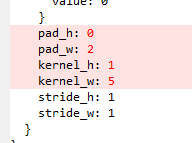
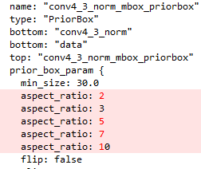
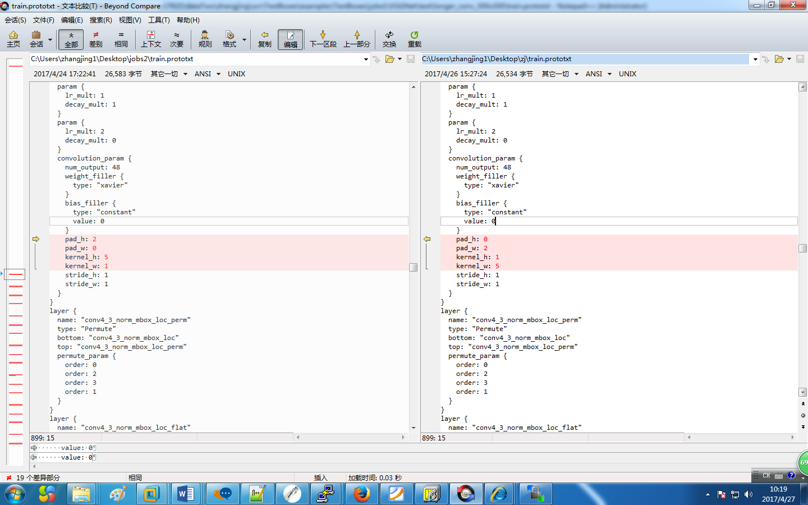
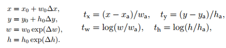
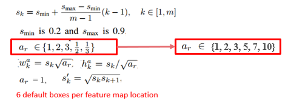
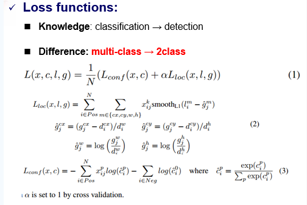
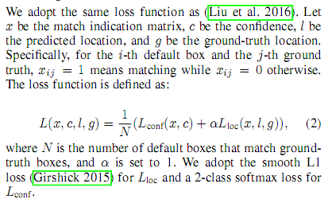
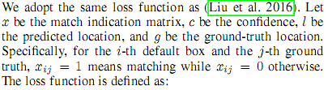

**TextBox实验记录**

**TextBoxes：A Fast Text Detector with a Single Deep Neural Network**

**TextBox的代码地址：[*https://github.com/MhLiao/TextBoxes*](https://github.com/MhLiao/TextBoxes)**

**论文解释 [*http://www.cnblogs.com/lillylin/p/6204099.html*](http://www.cnblogs.com/lillylin/p/6204099.html) **

**[*http://blog.csdn.net/peaceinmind/article/details/51387367*](http://blog.csdn.net/peaceinmind/article/details/51387367) 文本检测方法汇总**

**一．TextBox简介**

**TextBoxes是改进版的SSD，用来解决文字检测问题。**把SSD进行修改，使其适用于文字检测**（SSD本身对小目标识别不鲁棒）。它提供了端到端识别的pipeline: **

**TextBoxes**改进的SSD的地方：

> 1.default box的长宽比**进行修改（长条形），使其更适合文字检测（单词）**
>
> **2.作为classifier的**卷积滤波器**大小从3\*3变成**1\*5**，更适合文字检测**
>
> **3.SSD原来为多类检测问题，现在转为**单类检测**问题**
>
> **4.从输入图像为单尺度变为多尺度**

-   TextBoxes网络结构

-   {width="5.2694827209098865in" height="2.2761187664041995in"}

-   **备注**：上面每个蓝色的卷积层可预测box（location）和confidence，最后loc和conf经过1\*5的卷积到Text-box layers (可以看出是多尺度的，因为是不同尺度的特征图大小得到的box)

-   SSD 网络结构{width="5.820895669291339in" height="1.700009842519685in"}

**TextBox中第一个回归的卷积层中一共有12个default box。aspect\_ratio为1,2,3,5,7,10。min\_size: 30.0。没有max\_size。因此，特征图的每个像素对应生成的default box分别为：（box的面积不变，长方形宽高比1:1,2:1,3:1等）**

**（1）宽高都为30，box的中心位于网格中心。宽高比为1:1。如下图4\*4的网格中蓝色的default box。**

**（2）宽高都为30，box的中心在位于网格的下边缘的中心。宽高比为1:1。如下图4\*4的网格。红色和蓝色的default box为。如下图4\*4的网格中红色的default box。**

**（3）面积为30\*30，box的中心在位于网格的中心。宽高比为2:1。宽为30\*sqrt(2), 高为30/sqrt(2)。**

**（4）面积为30\*30，box的中心在位于网格的下边缘的中心。宽高比为2:1。宽为30\*sqrt(2), 高为30/sqrt(2)。**

**（5）面积为30\*30，box的中心在位于网格的中心。宽高比为3:1。宽为30\*sqrt(3), 高为30/sqrt(3)。**

**（6）面积为30\*30，box的中心在位于网格的下边缘的中心。宽高比为3:1。宽为30\*sqrt(3), 高为30/sqrt(3)。**

**（7）面积为30\*30，box的中心在位于网格的中心。宽高比为5:1。如下图4\*4的网格中黑色的default box。宽为30\*sqrt(5), 高为30/sqrt(5)。**

**（8）面积为30\*30，box的中心在位于网格的下边缘的中心。宽高比为5:1。如下图4\*4的网格中绿色的default box。宽为30\*sqrt(5), 高为30/sqrt(5)。**

**（9）面积为30\*30，box的中心在位于网格的中心。宽高比为7:1。宽为30\*sqrt(7), 高为30/sqrt(7)。**

**（10）面积为30\*30，box的中心在位于网格的下边缘的中心。宽高比为7:1。宽为30\*sqrt(7), 高为30/sqrt(7)。**

**（11）面积为30\*30，box的中心在位于网格的中心。宽高比为10:1。宽为30\*sqrt(10), 高为30/sqrt(10)。**

**（12）面积为30\*30，box的中心在位于网格的下边缘的中心。宽高比为10:1。宽为30\*sqrt(10), 高为30/sqrt(10)。**

{width="2.850746937882765in" height="2.7774365704286965in"}

**TextBox中其他的回归的卷积层中一共有14个default box。aspect\_ratio为1,2,3,5,7,10。既有min\_size。还有max\_size。**

**(min\_size对应的宽高比例1:1,2:1,3:1,5:1,7:1,10:1, max\_size对应有2个1:1的box,卷积层越往下，图像大小越小，size越大 )**

**二．TextBox训练过程**

1.  **环境准备**

> **在100的服务器上用nvidia-docker从镜像gds/keras-th-tf-opencv中新建了caffe\_ys容器。按照caffe的依赖文件，并编译GPU版本。**

1.  **数据准备**

> **训练数据为/dataTwo/datasets/data/str/SynthText的85万数据。**
>
> **创建数据生成脚本。该脚本从gt.mat中读出图像的路径和宽高，以及图像文本中的box坐标，分别保存在和图像同名txt文档中。**
>
> **该脚本的存放位置为：**
>
> **/dataTwo/yushan/darknet-master/voc\_label\_text\_xml\_for\_ssd.py**

1.  **标签生成**

> **使用windows下的xml生成工具，将上面的txt文档转化为VOC PASCAL格式的xml文件，以及图像的名称的索引文件train\_total.txt**
>
> **使用文本打乱工具，将train\_total.txt中的各行打乱，分别生成train\_val.txt和test.txt。**

1.  **训练**

> **(1)修改create\_data.sh中的数据路径和labelmap\_voc.prototxt路径，以及lmdb数据的保存路径，并将其脚本重新保存为create\_data\_text.sh使用/dataTwo/yushan/TextBoxes/data/VOC0712/create\_data\_text.sh。将训练数据转化为lmdb的格式。该脚本会自动将lmdb的数据保存到/dataTwo/yushan/TextBoxes/jobs1/textdata中。**
>
> **(2)使用train\_icdar13.py，会生成jobs文件夹，并生成对应的训练脚本文件，以及models生成对应的网络结构，优化器。**
>
> **将train和test的网络结构中的数据源修改为上面生成的lmdb的数据。启动训练。**
>
> **train\_icdar13.py的存放位置如下：**
>
> **dataTwo/yushan/TextBoxes/examples/TextBoxes/train\_icdar13.py**

**训练了16万次迭代，batch\_size为 16，使用sgd优化器，最终在15万次迭代时，测试的性能最好。**

**Test net output \#0: detection\_eval = 0.782504**

**Iteration 150000, loss = 2.42571**

> **训练的日志保存路径如下： \\dataTwo\\yushan\\TextBoxes\\jobs\\VGGNet\\text\\longer\_conv\_300x300\\VGG\_text\_longer\_conv\_300x300\_1.log**

**因此，后面使用的预测模型的路径为**

> **dataTwo/yushan/TextBoxes/models/VGGNet/text/longer\_conv\_300x300/VGG\_text\_longer\_conv\_300x300\_iter\_150000.caffemodel**

**该模型对横着的文本检测效果还可以，尤其是多尺度检测时，虽然速度较慢，但是大部分都能正确的检测出来。但是检测不到竖值的文本。**

**四．修改TextBox的结构重新训练**

**鉴于之前检测不到竖值文本，修改了候选框，增加了竖值的候选框。**

**前面的标签仍然可以使用，这里唯一需要修改的是models文件夹下面的train.prototxt，test.prototxt和deploy.prototxt。修改这三个文件中的回归的卷积层中的卷积核个数以及PriorBox层的参数。这里将修改后的网络结构重新存放在jobs1文件夹下。**

**这里简单截图示意一下。左边是原始的横框，右边是增加了竖框的结构。**

{width="6.428472222222222in" height="4.354166666666667in"}

{width="7.23027668416448in" height="4.21875in"}

> **训练了29万次迭代，batch\_size为 16，使用sgd优化器，最终在26万次迭代时，测试的性能最好。**
>
> **Test net output \#0: detection\_eval = 0.804227**
>
> **Iteration 260000, loss = 1.78662**
>
> **训练的日志保存路径如下： dataTwo\\yushan\\TextBoxes\\jobs1\\VGG\_text\_longer\_conv\_300x300.log**
>
> **因此，后面使用的预测模型的路径为**
>
> **dataTwo/yushan/TextBoxes/jobs1/ /VGG\_text\_longer\_conv\_300x300\_iter\_260000.caffemodel**

**遗憾的是，修改网络结构后训练出来的新模型，对于竖值的文本检测效果依旧不理想，改善效果甚微。怀疑是85万的数据集中竖值文本太少。**

**备注：**

**测试： python example/TextBoxes/test\_icdar13.py （需要修改代码里面的图片路径（需要检测的图片名称存放在.list文件里面）、下载权重文件.caffemodel）**

**训练：**

1.  **先cd /dataTwo/zhangjing/ocr/TextBoxes/examples/TextBoxes**

2.  **修改train\_icdar13.py文件中的训练、测试图片路径，如：**

train\_data = "/opt/yushan/TextBoxes/jobs1/textdata/**textdata\_trainval\_lmdb**"

\# The database file for testing data. Created by data/text\_10x/create\_data.sh

test\_data = "/opt/yushan/TextBoxes/jobs1/textdata/**textdata\_test\_lmdb**"

运行：python **train\_icdar13.py生成jobs、models文件夹，**jobs下面的VGG\_text\_longer\_conv\_300x300.sh执行训练模型，如果想**增加了竖值的候选框。前面的标签仍然可以使用，这里唯一需要修改的是models文件夹下面的train.prototxt，test.prototxt和deploy.prototxt。修改这三个文件中的回归的卷积层中的卷积核个数以及PriorBox层的参数。**

**修改：**

1.  将**w:h=2:1,3:1，5:1,7:1,10:1 改成w:h=1:2,1:3,1:5,1:7,1:10.**

    -   **修改1:**从层名为**conv4\_3\_norm\_mbox\_lo**c开始修改，因为在看textboxes结果图时从这个层开始预测box位置。 （12处，6个loc,6个conf） (1:5体现TextBoxes网络结构中的1:5)

> {width="2.0in" height="1.4895833333333333in"}
>
> **修改2：mbox\_priorbox: 制定box规则的层，默认的1:1的box以及box不同中心点都在源码中写好的。min\_size、max\_size 指不同层的box大小不同。**

{width="2.7083333333333335in" height="2.3229166666666665in"} {width="2.4479166666666665in" height="2.2083333333333335in"}

> {width="6.276521216097988in" height="3.9270833333333335in"}

1.  **添加竖直框：**

> **因为既有竖直框也有水平框，所以就将卷积核改回之前的3\*3; flip=true表示box的比例再反一下，比如aspect\_ratio: 2，就多一个aspect\_ratio: 1/2.**
>
> **conv4\_3\_norm\_mbox\_loc: **
>
> **(num\_output) 88 = 4（x,y,w,h）\*{11(1,2,3,5,7,10,1/2,1/3,1/5,1/7,1/10) \* 2(box的2种中心点情况)}**
>
> **conv4\_3\_norm\_mbox\_conf: **
>
> **(num\_output) 44 = 11(1,2,3,5,7,10,1/2,1/3,1/5,1/7,1/10) \* 2(box的2种中心点情况)**
>
> **备注： loc、conf对应的都有修改**

![C:\\Users\\zhangjing1\\AppData\\Roaming\\Tencent\\Users\\463261929\\QQ\\WinTemp\\RichOle\\OTZ\`ZR6U8%}\]BR\~@E6G4\]KH.png](TextBox实验记录/media/image10.png){width="5.895833333333333in" height="5.072916666666667in"}

1.  ![C:\\Users\\zhangjing1\\AppData\\Roaming\\Tencent\\Users\\463261929\\QQ\\WinTemp\\RichOle\\O3B\~\]\`LDLY2LF9{TRRA5\[\`C.png](TextBox实验记录/media/image11.png){width="6.34375in" height="3.1875in"}

**备注：**

**安装：**

1.  cd TextBoxes

> 复制Makefile.config.example，重命名为Makefile.config；

make -j8

make pycaffe

**知识点备注：**

1.Step 1: 图像输入到**修改版SSD网络**中 + 非极大值抑制（NMS）→ 输出候选检测结果

Step 2: 候选检测结果 + **CRNN进行单词识别** → 新的检测结果 + 识别结果

2.输出层：{width="1.8854166666666667in" height="0.3645833333333333in"}bounding box regression

{width="4.614583333333333in" height="0.9895833333333334in"}

TextBoxes与SSD不同的修改细节:如下
---------------------------------

**3.default boxes的宽高比例：**

Ssd textbox

{width="4.864583333333333in" height="0.4166666666666667in"}

{width="4.947916666666667in" height="1.8541666666666667in"}

其中m等于6,用于预测loc层的个数，对应textbox而言m=6，Sk这个公式就将从Smin到Smax等间隔分配；Wk/hk=宽高比；

同一个比例的box: box的中心位于**网格中心**、box的中心在位于**网格的下边缘的中心**这两种情况；

**4.卷积滤波器的大小：**

因为words 一般是长条形的，所以滤波器大小从ssd的3\*3变成1\*5, (row\*col)

![C:\\Users\\zhangjing1\\AppData\\Roaming\\Tencent\\Users\\463261929\\QQ\\WinTemp\\RichOle\\UK\]BT{36Q\]EX2A\_JB\]VXZG4.png](TextBox实验记录/media/image16.png){width="1.8541666666666667in" height="0.3645833333333333in"}

**5.loss函数：**

{width="5.25in" height="3.5in"}

{width="4.354166666666667in" height="2.65625in"}

{width="4.21875in" height="1.15625in"}

**L对应是region Proposal，g对应是ground truth**

**Smooth L1 loss: 用于计算位置loss**

![C:\\Users\\zhangjing1\\AppData\\Roaming\\Tencent\\Users\\463261929\\QQ\\WinTemp\\RichOle\\WB\_K}7\]Z37T\[PE\_VP\]O\$SZD.png](TextBox实验记录/media/image20.png){width="4.760416666666667in" height="0.9375in"}

**softmax loss：用于计算Confidence loss**

[***http://freemind.pluskid.org/machine-learning/softmax-vs-softmax-loss-numerical-stability/***](http://freemind.pluskid.org/machine-learning/softmax-vs-softmax-loss-numerical-stability/)

**6.**

![C:\\Users\\zhangjing1\\AppData\\Roaming\\Tencent\\Users\\463261929\\QQ\\WinTemp\\RichOle\\{F\]E1}(6BZA\$A4CPKI\~J%YB.png](TextBox实验记录/media/image21.png){width="4.66616469816273in" height="2.90625in"}

**如何做的多尺度的？？？**通过对不同的特征图进行位置预测实现的。

**还没弄明白的地方：**

如果添加box, 需要改deploy.prototxt 里面的滤波器大小。
